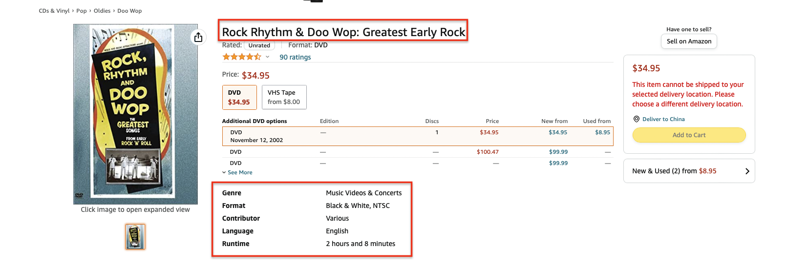
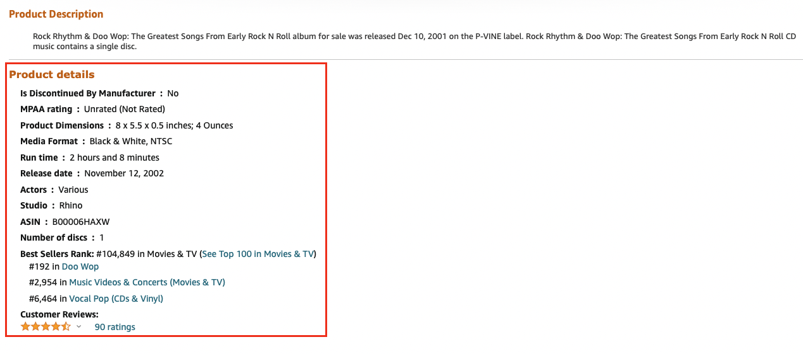
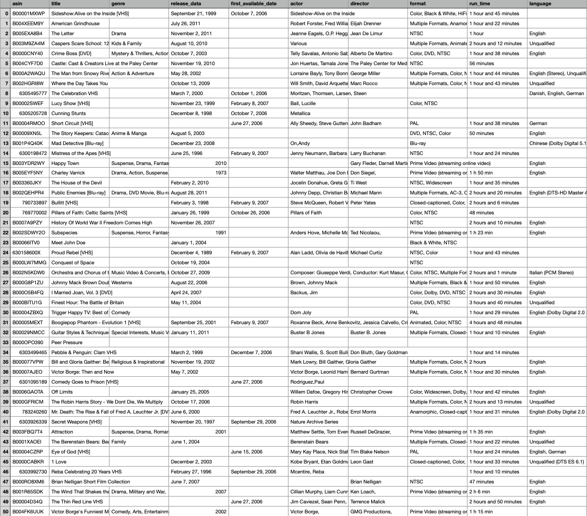
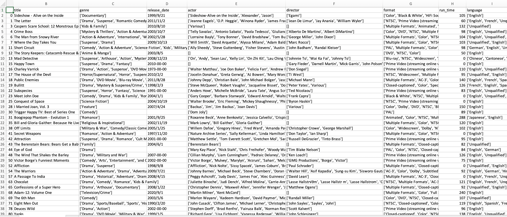
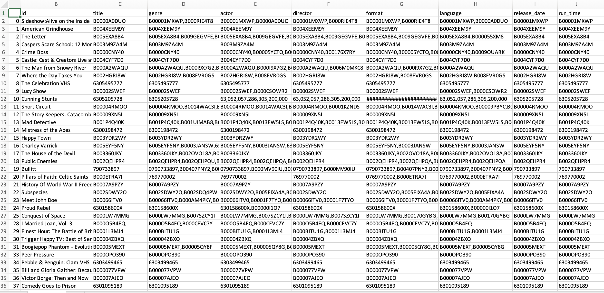

# DataWarehouse

数据仓库文档

## 数据爬取

- 准备工作

  数据来源是一个包含了7911684个用户评价的txt文档，这里是[下载链接](http://snap.stanford.edu/data/web-Movies.html)。下载完解压后是一个9G左右的movies.txt文档，下面是一条用户评价的示例：

  > product/productId: B00006HAXW
  >
  > review/userId: A1RSDE90N6RSZF 
  >
  > review/profileName: Joseph M. Kotow 
  >
  > review/helpfulness: 9/9 
  >
  > review/score: 5.0 
  >
  > review/time: 1042502400 
  >
  > review/summary: Pittsburgh - Home of the OLDIES review/text: I have all of the doo wop DVD's and this one is as good or better than the 1st ones. Remember once these performers are gone, we'll never get to see them again. Rhino did an excellent job and if you like or love doo wop and Rock n Roll you'll LOVE this DVD !!

  我们会发现，每条评价包含了7个字段，分别是：

  - productId: 产品的asin，可以用来访问该产品的详细网页，如[amazon.com/dp/B00006HAXW](http://amazon.com/dp/B00006HAXW/)
  - userId: 用户id
  - profileName: 用户名
  - helpfulness: fraction of users who found the review helpful
  - score: rating of the product
  - time: time of the review (unix time)
  - summary: review summary
  - text: text of the review

  这每个字段都以一行的形式出现在文本文档中，因此只需要用python的`readline()`函数，再根据字符串的前缀来判断字段属性即可，如下：

  ```python
  f = open('movies.txt', 'rb')
  movies_list = []
  while True:
    line = f.readline()
    if not line:
      break
    else:
      try:
        line_gbk = line.decode('gbk', 'ignore')
      except Exception as e:
        print(e)
      # print(line_gbk,end="")
      if 'product/productId' in line_gbk:
        asin = line_gbk.split('product/productId: ')[-1].strip('\n')
        if asin not in movies_list:
          movies_list.append(asin)
      elif 'review/userId' in line_gbk:
        pass
      ......
  print(movies_list)
  ```

  这一步，我们需要保存所有电影的asin码到`movies_list`中，以便在后续爬虫的过程中可以去访问某个产品对应的电影。

  ```python
  import numpy as np
  ...
  np.save("movies_list.npy", movies_list)
  ```

- 爬取html源码

  由于我有足够的大容量硬盘，我选择的是先爬取html源码，再分析html源码。遍历源码的时间比起重新爬虫而言是很快的，因此在后续若发现有遗漏的电影字段，可以较快地重新分析html源码得到。

  我采用selenium库中的webdriver模拟自动化爬虫。首先是可以通过每个产品对应的asin码来访问产品详细页面，即

  ```python
  from selenium import webdriver
  ...
  def read_with_certain_index(start, end, save_path):
    driver = webdriver.Safari()
    for index in range(start, end + 1):
      asin = movies_list[index]
      url = 'https://www.amazon.com/-/en/dp/' + asin
      driver.get(url)
      source = driver.page_source # 获取页面源码
      with open(os.path.join(save_path, asin + ".html"), 'w', encoding="utf-8") as f:
        f.write(source)
  ```

  为加快速度，可以采用多线程爬取，在确认线程数时需要注意自己电脑的核数。我用来爬取的电脑是6核的，为了凑整我采用5线程并行爬取。如果超出电脑核数会导致某些线程出错退出，该轮可能就白爬了，因此谨慎谨慎。

  对于所有的25w条电影产品，我分0w-10w, 10w-20w, 20w-25w进行爬取。比如在爬取0w-10w时，我分为5个线程，分别爬取0w-2w, 2w-4w, ..., 8w-10w，如下所示。

  ```python
  import threading
  from read_html import read_with_certain_index
  save_path = "/Volumes/bGxyrious/DW/WebPages"
  start = 0
  end = 99999
  thread_number = 5 # 并行爬取的线程数
  if __name__ == "__main__":
    total_number = end - start + 1 # 爬取总数
    single_time = total_number // thread_number # 每个线程爬取的数目，需要保证能整除
    for index in range(thread_number):
          threading.Thread(
              target=read_with_certain_index,
              args=(start + index * single_time, start + (index + 1) * single_time - 1, save_path)
          ).start()
  ```

  使用selenium的自动化爬取，需要安装对应的浏览器驱动，我使用的是Safari和Chrome。关于selenium的使用可以自行学习。

  爬取所有html源码用时理论上是30小时左右，由于中途出现几次线程崩溃导致重爬，大约真实采用4-4天才完全爬取完毕，共占据155G。

- 分析html源码

  对于html页面源码的解析可以采用bs4中的BeautifulSoup，当然也可以采用如Xpath等工具。

  下面是一个典型并且出现频率最高的页面结构[B00006HAXW](http://amazon.com/-/en/dp/B00006HAXW/)。

  
  
  
  
  可以发现，主要的信息集中在红色框选中的区域，因此我们对该区域的页面进行解析。比如解析标题，我们查看页面源码，找到标题所在的元素，发现是个span标签：
  
  ```html
  <span id="productTitle" class="a-size-large product-title-word-break">        Rock Rhythm &amp; Doo Wop: Greatest Early Rock       </span>
  ```
  
  我们用html源码去生成BeautifulSoup对象，然后用该对象的find函数找到这个标题标签，即
  
  ```python
  try:
    html_path = "./B00006HAXW.html"
    with open(html_path) as file:
      source = file.read()
      soup = BeautifulSoup(source, features='lxml')
      movie_title = get_title(soup)
  
  def get_title(soup):
    title = ""
    try:
      span = soup.find('span', id="productTitle")
      title = span.text
    except Exception as error:
      pass
    return title
  ```
  
  诸如这样，可以获取一系列商品的数据，如标题title、风格genre、发布日期ReleaseDate、演员Actor、导演Director、格式Format、时长Runtime、语言Language等等，将其他保存起来存到csv中。
  
  ```python
  def write_info_to_file(target_list, path):
    # target_list行数即为所有的商品个数
    name = ["asin", "title", ...]
    csv_file = pd.DataFrame(columns=name, data=target_list)
    csv_file.to_csv(path)
  ```
  
  保存得到的csv文件如下所示：
  
  

## 数据清洗
> 对于爬虫得到的源数据，可以发现十分杂乱，还有很多对应的是健身操、音乐歌曲等产品，因此需要对筛选内容、调整格式。

### 处理运行时长

可以发现，运行时长（即上图*run_time*栏）的格式比较统一，总的而言有以下四种（显然如果只有3秒钟，这肯定不是一部电影，但是在此先不管这件事，本步骤只把运行时长转换为分钟的形式）

- 2 hours and 34 minutes
- 1 h 35 min
- 2 hours 或 47 minues
- 40min 或 3sec

这里用了正则表达式和字符串匹配的一些函数，最后将时分秒作转换再返回字符串即可。

```python
def runtime_cleaner(runtime: str):
  hour, minute, second = 0, 0, 0
    try:
      runtime_list = runtime.split(' ')
      for index in range(len(runtime_list)):
        item = runtime_list[index]
        if item.isalpha():
          if 'hour' in item or 'h' == item: # 'hour' in 'hours'
            hour = int(runtime_list[index - 1])
          elif 'minute' in item or 'min' == item: # 'minute' in 'minutes'
            minute = int(runtime_list[index - 1])
          else:
            alphas = re.search(r'[a-zA-Z]+', item)
            numbers = re.search(r'[0-9]+', item)
            if alphas and numbers:
              alphas = alphas.group()
              numbers = int(numbers.group())
              minute = numbers if 'min' in alphas else 0
              hour = numbers if 'h' in alphas else 0
              second = numbers if 'sec' in alphas else 0
    except Exception as error:
      # print(error)
      pass
  return str(hour * 60 + minute + second // 60)
```

### 筛选非电影部分

由于在产品中包括了很多如健身操、电视剧、纪录片、音乐会、短视频等类别，因此需要对非电影部分进行筛选。

首先，最有力的筛选方式是运行时长，这里认为在运行时长存在的情况下（有些产品并不存在运行时长），小于40分钟或大于400分钟的产品，属于非电影。

其次，可以根据关键词进行电影的筛选，关键词主要针对产品的标题title和风格genre，下面是我选择的筛选关键词：

```python
title_keyword = ['/', 'Exercise', 'PBS', 'CD', 'Analysis of', 'technique', 'Collection', 'teach', 'learn', 'instruct', 'Hollywood', 'Bollywood']
genre_keyword = ['Music Video', 'Concert', 'Special Interest', 'Exercise', 'Fitness', 'CD', 'documentary', 'series', 'BBC', 'episode', 'season']
```

其中，title关键词中，出现`/`的一般都是包含了多部电影的产品，这会导致电影的风格、演员、导演等都产生偏差，因此不作记录；对于出现了`Exercise, Analysis of, technique, teach, learn, instruct`等词的title，为电影的可能性较小，因此也筛除。

在genre关键词中，`Music Video, Concert, CD`表示音乐相关，`Exercise, Fitness`表示运动健身相关，`documentary`表示纪录片、`series, episode, season`表示连续剧，`BBC`表示广播视频。以上这些都是非电影，因而直接筛除。

```python
def isMovie(row: pd.Series):
    run_time = int(row["run_time"])
    if not pd.isna(run_time) and run_time != 0 and (run_time >= 400 or run_time <= 40):
      return False
    title, genre = row['title'], row['genre']
    for kw in title_keyword:
      if not pd.isna(title) and kw in title:
        return False
    for kw in genre_keyword:
      if not pd.isna(title) and kw in genre:
        return False
    return True
def movies_filter(movies_info: pd.DataFrame):
    waiting_delete_index = []
    for index, row in movies_info.iterrows():
        if not isMovie(row):
            waiting_delete_index.append(index)
    return movies_info.drop(index=waiting_delete_index)
```

### 处理电影标题

通过观察数据，我发现电影标题中存在描述产品信息的`()[]`，比如`Sideshow:Alive on  the Inside [VHS]`或`A Passage To India  (2-Disc Collectors Edition)`，它们是冗余的电影标题信息，利用正则表达式可以很容易地将字符串中的括号匹配出来并删除；此外，电影标题中还存在引号不规范、括号不匹配、换行符多余的情况，在这里都一并使用正则表达式处理；最后将标题前后的括号进行去除，代码如下所示。

```python
def title_cleaner(target: pd.Series):
    # 清理标题
    target = remove_brackets(target)
    target = remove_special_characters(target)
    return target
  
def remove_special_characters(target: pd.Series):
    # 删除替换不规范字符
    target = target.apply(lambda c: c.encode('utf-8').decode())
    target = target.apply(
        lambda c: re.sub(r"‘|’|”|“", "'", c).strip()
    )
    target = target.apply(
        lambda c: re.sub(r"\n|\r|'\n|'\r", "", c).strip()
    )
    target = target.apply(
        lambda c: c.strip()
    )
    return target
  
def remove_brackets(target: pd.Series):
    # 删除括号
    target = target.apply(
        lambda c: re.sub(r"\(.*?\)|\{.*?}|\[.*?]", "" , c)
        )
    target = target.apply(
        lambda c: re.sub(r"\(.*?$|\{.*?$|\[.*?$", "" , c)
        )
    target = target.apply(
        lambda c: re.sub(r"\)|\]|\}", "", c)
    )
    return target
```

### 处理各个字段信息

- language

  language和标题字段类似，都需要删除括号和特殊字符，此外还有一些产品的language字段为空，在csv中会自动赋值为nan，在这里统一填充为空字符，以方便后续处理。

- genre, actor, director, format, language, release_date, first_available_date, run_time

  这些字符串不需要额外的处理，只需要将一些特殊字符去除即可，因此调用`remove_special_characters`函数即可。

  ```python
  def value_cleaner(movies_info: pd.DataFrame):
      movies_info.fillna(value='', inplace=True)
      for attr in ('title', 'genre', 'actor', 'director', 'format', 'language', 'release_date', 'first_available_date', 'run_time'):
          movies_info[attr] = remove_special_characters(movies_info[attr])
      return movies_info
  ```

### 转换为List列表

由于很多字段都由多个单值组成，如actor中由很多个演员名称组成，因此在这里将这些字段转换为List以方便后续的处理。

各个单值都是使用逗号进行分割的，因此直接使用`.split(',')`转换为List，再使用`.stript()`去掉前后的空格即可。

```python
for attr in ('genre', 'actor', 'director', 'format', 'language'):
    movies_info[attr] = movies_info[attr].apply(convert_to_list)
    
def convert_to_list(list_str: str):
    new_list = list(map(lambda list_str: list_str.strip(), list_str.split(',')))
    while '' in new_list:
        new_list.remove('')
    return new_list
```

### 日期标准化

对于数据中的日期，总体而言有三种形式，空缺、纯数字年份和年月日日期。对于空缺值仍然保留，对于纯数字年份填充为2022-0-0，对于完整的日期则化简为2022-1-1的形式。

年月日日期的格式都形如`August 10, 2010`的格式，因此先设置本机地域，然后采用时间类`datetime.striptime`去格式化解析时间，并转化为标准形态`2022-1-1`。

对于空缺值，在电影合并的时候会从第三方数据源重新获取，会在后面进行说明。

```python
for attr in ('release_date', 'first_available_date'):
    movies_info[attr] = movies_info[attr].apply(date_cleaner)
    
def date_cleaner(date_str: str):
    if date_str == '':
        pass
    elif date_str.isdigit():
        date_str = '{}-00-00'.format(date_str)
    else:
        try:
            locale.setlocale(locale.LC_ALL, 'en_US.utf8')
            date_str = str(datetime.strptime(date_str, '%B %d, %Y').date())
        except Exception as error:
            print(error)
    return date_str
```

### 合并电影

由于爬虫的数据源是电影的各种产品，而不同产品可能对应同一部电影，因此需要对相同的电影进行合并。这里采用的合并策略主要依据电影名，由于已经对电影title进行清理，同一部电影的名称有高度的相似性，因此该方法是合理的。在后续查看合并日志的时候，我发现合并的电影确实都是名字相同或高度类似的。

- 模糊匹配

  电影名的匹配主要采用`rapidfuzz.process`模块中的`.extractOne()`方法，采用的字符串相似度计算方法是**Levenshtein Distance**算法，是指两个字符串之间，由一个转成另一个所需的最少编辑操作次数。许可的编辑操作包括将一个字符替换成另一个字符，插入一个字符，删除一个字符。一般来说，编辑距离越小，两个串的相似度越高。

  该方法的参数是字符串和字符串List，返回该字符串在字符串List中的最高匹配对象以及相似度评分。经过数据的预测试，我发现将评分为95以上的电影名基本是同一部电影，它们相差的可能只是一些空格、标点符号，因此可以认为是同一部电影。

- 合并策略

  先设置一个空的影名字典`title_dict`（此处为了存储电影名在本来的DataFrame中的索引，将列表替换为字典）和空的待删除索引列表`waiting_delete_list`，然后遍历所有电影名，使用上述模糊匹配算法，计算某个电影名在影名列表中的匹配程度，由于它是第一次遍历到，因此命名为`new_name`，而本来就在影名列表中存在的，命名为`old_name`。

  如果评分超过95，说明在影名列表中已经有相同电影，此时将这两部电影的信息进行比对整合，并将new_name的索引添加到待删除索引列表，将并更新血缘关系表；如果评分没有超过95，说明该电影未出现，则将其加入电影列表，并更新血缘关系表。

- 字段的合并

  字段的合并策略分为三类，下面分别进行讲述：

  1. 影名`title`

     采取更长影名作为新的影名

  2. 列表值`genre, actor, director, format, language` 

     将新值在旧值列表中进行相似度匹配，如果评分低于95就添加为新值，否则直接废弃；空缺值也包含于上述的处理方法之中。

  3. 日期值

     由于日期值都很多空缺，因此采用第三方数据源进行搜索。我维持每部电影的日期值不空缺，即当出现新值时，若是空缺，则前往第三方数据源进行查找。当出现影名列表中已有的电影时，若日期的新值不为空，则比较两者并选出更早的日期值。

  4. 运行时长

     类似影名，选择运行时间更长的，并更新血缘关系表。

### 第三方数据源

当有相关数据在亚马逊无法爬取获得时，我们需要寻找第三方数据源进行补充，这里我主要采用来自imdb作为数据源的补充。

在[https://imdb-api.com/swagger/index.html](https://imdb-api.com/swagger/index.html)中提供了对IMDB数据的查找API，在注册账号后就可以免费获取apiKey，通过该apiKey便可以调用其提供的api。我主要采用了两个api，如下所示：（我的apiKey=k_fjhihha0）

```python
if pd.isna(row['release_date']):
    url1 = 'https://imdb-api.com/API/SearchMovie/k_fjhihha0/' + title
    response = requests.get(url1) # 第一个
    res_json = json.loads(response.text)
    movie_id = res_json.get('results')[0].get('id')
    url2 = 'https://imdb-api.com/en/API/Title/k_fjhihha0/' + movie_id
    response = requests.get(url2) # 第二个
    movie_json = json.loads(response.text)
    release_date = movie_json.get('releaseDate')
    new_series_dict['release_date'] = url2
    movies_info.loc[index, 'release_date'] = release_date
```

1. 第一个api是通过电影名查找匹配的电影，并获取这些电影的标识符id等信息，组成列表。若某些信息在亚马逊不存在，则使用影名去调用该api，以获取电影标识符，再进一步通过下面的api获取电影信息。
2. 第二个api是通过电影标识符id查找该电影的详细信息，上述代码中，我获取了放映日期这个信息，作为原来数据源的补充。

### 处理相同姓名（演员、导演）

相同姓名的处理类似合并电影名，设置一个空的姓名列表，并遍历所有的演员、导演名，由于导演和演员之间可能存在交叉，因此两者共用一个姓名列表。对于某一个姓名，查询它在姓名列表中的匹配率，如果评分大于95分，则将该名称进行替换；否则就将其加入新的姓名列表。并且可以新建一个姓名表并设置主键索引，将主表中的演员、导演字段替换为姓名表的外键，从而减少主表查询的负担。

## 处理结果

1. 电影信息表

   在电影的评论中，一共有25w+条数据，在爬虫后剔除了一些失效页面后，还剩下24w+条数据，经过电影产品的筛选、相同电影的合并，最终剩下10w+电影产品。



相比其他同学的结果，我最终剩余的数量偏少，在查看了合并日志(merge_log.txt)后，即如下：

```
Triumph of Love ==? Triumph of Love
Benji ==? Benji
Stargate ==? Stargate
Mystery Men ==? Mystery Men
Circus ==? Circus
Enchanted April ==? Enchanted April
My Little Chickadee ==? My Little Chickadee
Intermission ==? Intermission
The Comedy Jesus Show ==? The Comedy Jesus Show
Open Water ==? Open Water
Secondhand Lions ==? Secondhand Lions
Fearless ==? Fearless
The Pebble and the Penguin ==? The Pebble and the Penguin
Gunga Din ==? Gunga Din
Limelight ==? Limelight
Age of Heroes ==? Age of Heroes
Aliens ==? Aliens
Year of Getting to Know Us ==? Year of Getting to Know Us
The Cops are Robbers ==? The Cops Are Robbers
Problem Child ==? Problem Child
A Marine Story ==? A Marine Story
Live Intrusion VHS ==? Live Intrusion VHS
David E.David E. Talbert's A Fool and His Money ==? David E. Talbert's A Fool and His Money
Gitana Tenias Que Ser ==? Gitana Tenias Que Ser
Hangar 18Hangar 18 ==? Hangar 18
Integrated Qi Gong for Lower Back Pain ==? Integrated Qi Gong for lower back pain
77 Angels in Eden ==? 7 ANGELS IN EDEN
The Sitter ==? The Sitter
Monsters of Metal: The Ultimate Metal Compilation, Vol. 1Monsters of Metal: The Ultimate Metal Compilation, Vol. 1 ==? Monsters of Metal: The Ultimate Metal Compilation, Vol. 2
Sex & Zen :Sex & Zen : Extreme Ecstasy ==? Sex & Zen: Extreme Ecstasy
Por Ellas Aunque Mal Paguen ==? Por Ellas Aunque Mal Paguen
Mad Dog Morgan ==? Mad Dog Morgan
The Escapist ==? The Escapist
Sitting Ducks ==? Sitting Ducks
Baby on Board ==? Baby On Board
Mr.Mr. Winkle Goes to War ==? Mr. Winkle Goes To War
Bad Seed ==? Bad Seed
True Blue ==? True Blue
Wreckage ==? Wreckage
The Unit ==? The Unit
Jaded ==? Jaded
The Dresser ==? The Dresser
Seventh Brother ==? Seventh Brother
The Stationmasters Wife ==? The Stationmasters Wife
Beneath the Planet of the Apes ==? Beneath the Planet of the Apes
Ransom ==? Ransom
The Land Before Time -The Land Before Time - The Big Freeze ==? The Land Before Time - The Big Freeze
Jackson Pollock ==? Jackson Pollock
Interview with the Vampire:Interview with the Vampire: The Vampire Chronicles ==? Interview with the Vampire: The Vampire Chronicles
Hatchet For A Honeymoon ==? Hatchet for a Honeymoon
Space Marines ==? Space Marines
Strauss: The King of Three-Strauss: The King of Three-Quarter Time ==? Strauss: The King of Three-Quarter Time
Just Ask My Children ==? Just Ask My Children
Bluebeard ==? Bluebeard
Virasat ==? Virasat
Tai Chi for Diabetes ==? Tai Chi for Diabetes
Fever ==? Fever
Four Horsemen of the Apocalypse ==? Four Horsemen of the Apocalypse
Little Man ==? Little Man
Ship Ahoy ==? Ship Ahoy
```

我发现大多数电影的合并确实是有理有据的，因此思考可能是非电影产品的筛选过于严格，在经过相关参数的调整后重新运行，电影的总数达到了12w。

2. 血缘关系表

   在合并的过程中，记录了每个字段的来源，如亚马逊、豆瓣、IMDB等。如果有多个来源，则将其用逗号隔开。这张表的主键为电影名。通过电影名的合并，每个影名都是唯一的标识符，考虑到查询的速度，后续会将其用数字id代替。



